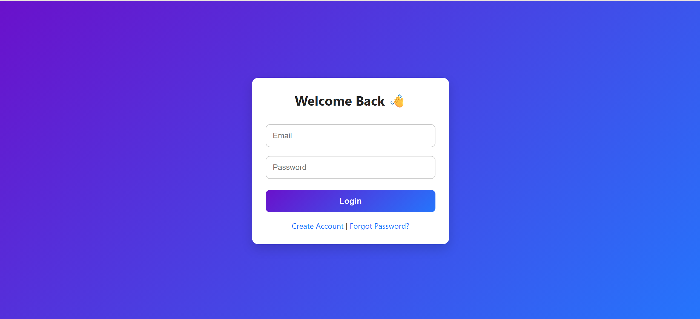
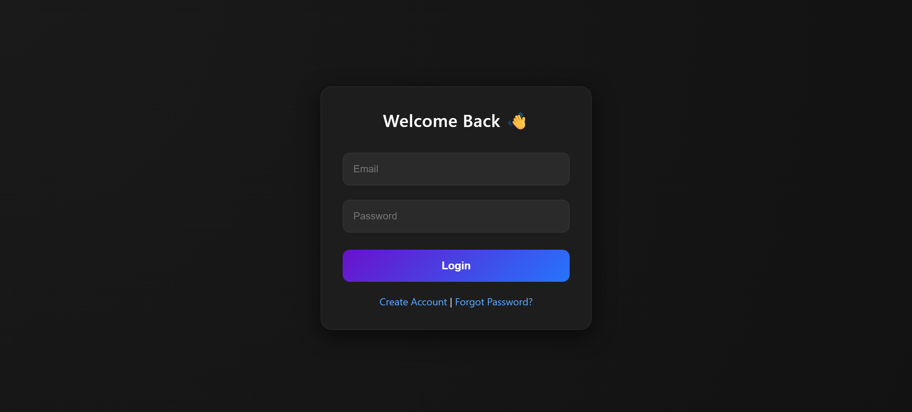
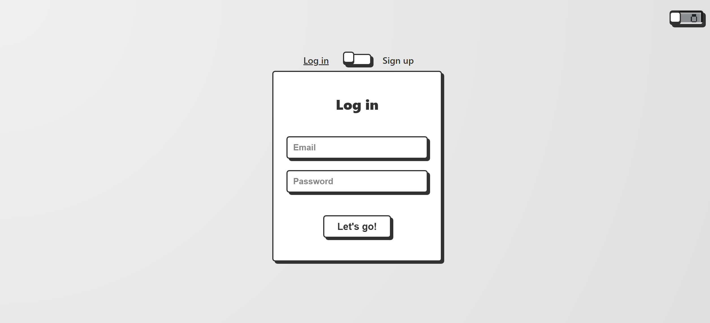

# 🔥 Auth UI Showcase Collection

A collection of modern **Authentication User Interfaces (UI)** including **Login, Register, and Forgot Password** pages.  
This project was created to **practice HTML, CSS, and JavaScript** skills while exploring different UI/UX styles.  

---

## ✨ Gallery

Here’s a showcase of all the available designs. Click on **Live Demo** to see them in action!

| Preview | UI Name | Tech Stack | Live Demo |
| :---: | :--- | :---: | :---: |
|  | **01. Classic Auth/> A clean and minimal login page. | `HTML` `CSS` | [Live Demo](https://tuandatcoder.github.io/auth-ui-collection/01-classic-auth/) |
|  | **02. Dark Mode Auth**   A sleek authentication set (Login, Register, Forgot, Home) with dark theme support. | `HTML` `CSS` `JS` | [Live Demo](https://tuandatcoder.github.io/auth-ui-collection/02-dark-mode-auth/) |
|  | **03. Flip Card Auth**   A creative flip card authentication with a sliding toggle for Login/Register. | `HTML` `CSS` `JS` | [Live Demo](https://tuandatcoder.github.io/auth-ui-collection/03-flip-card-auth/) |

---

## 🛠️ Tech Stack

- **HTML5**
- **CSS3** (Flexbox, Grid, Animations)
- **JavaScript** (DOM Manipulation, Validation)

---

## 🚀 How to Use

1. Clone this repository to your local machine.
2. Open the folder of the UI design you want to test.
3. Launch the `index.html` file in your browser.
4. Customize and experiment as you like!

---

💡 *Thanks for visiting! Feel free to fork, star ⭐, and share this collection with others.*